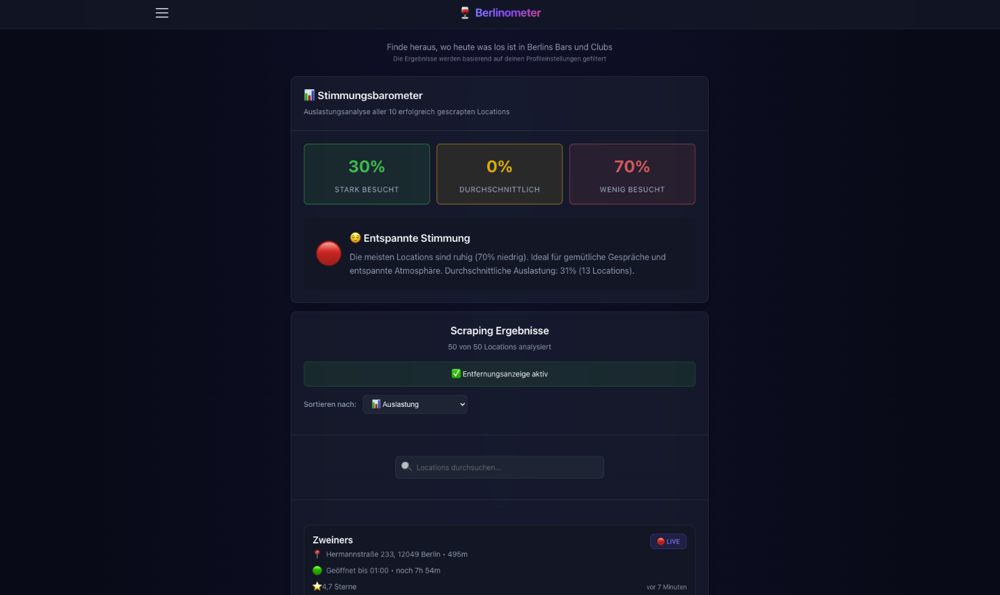
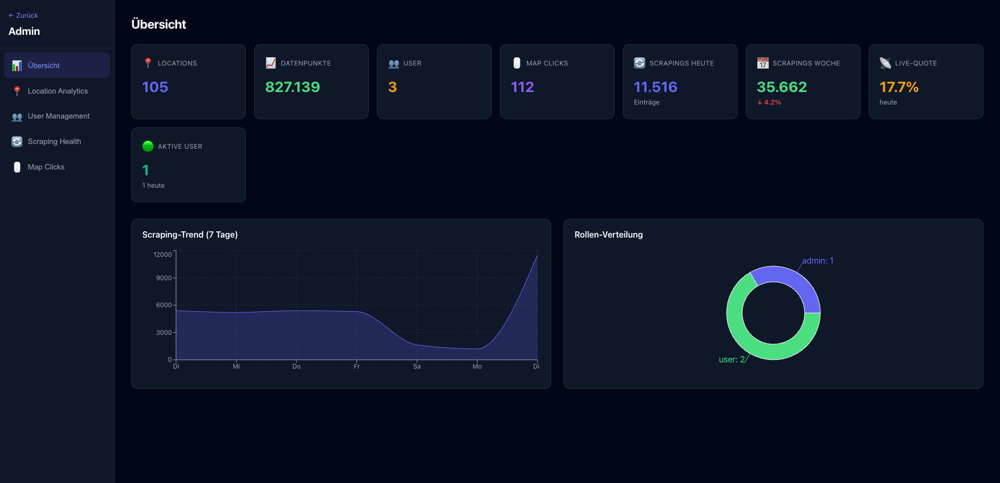
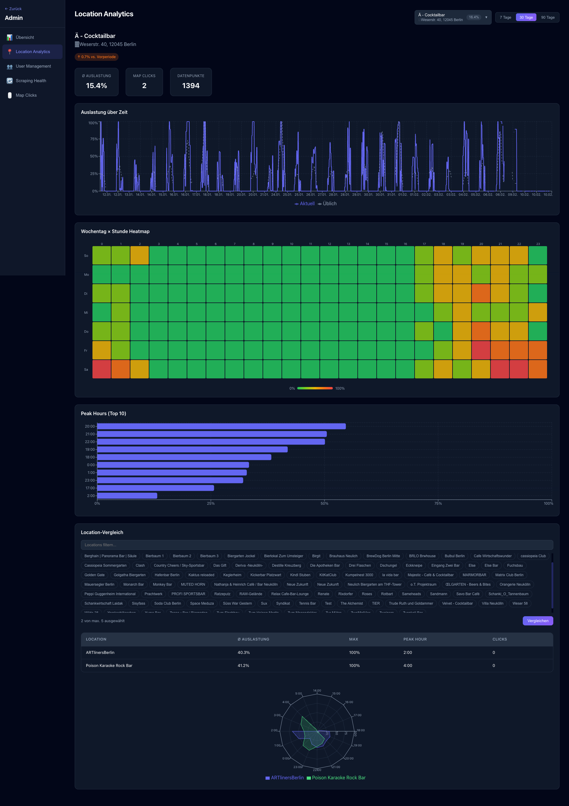
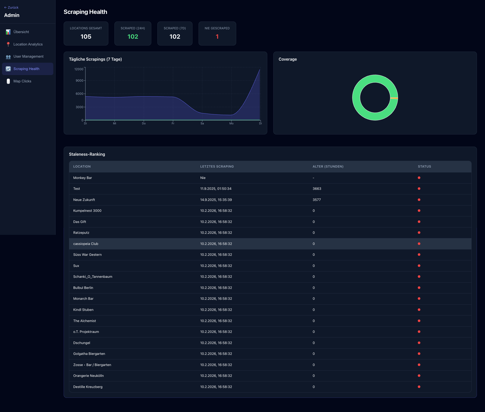

<div align="center">

# Berlinometer

**Echtzeit-Auslastungstracker für Berlins Bars und Clubs**

[](https://github.com/pepperonas/berlinometer/actions/workflows/ci.yml)
[](https://opensource.org/licenses/MIT)
[](https://github.com/pepperonas/berlinometer)
[](https://berlinometer.de)

[](https://react.dev)
[](https://vite.dev)
[](https://github.com/pepperonas/berlinometer)
[](https://github.com/pepperonas/berlinometer/commits/main)

[**berlinometer.de**](https://berlinometer.de)

[](README_EN.md)

</div>

---

Finde heraus, wo heute Nacht was los ist. Berlinometer scrapt Google-Maps-Auslastungsdaten für über 100 Bars und Clubs in Berlin und zeigt dir Echtzeit- sowie historische Füllstände, damit du den perfekten Spot findest.

## Screenshots

### Homepage


### Admin Panel - Übersicht


### Admin Panel - Location Analytics


### Admin Panel - Scraping Health


---

## Inhaltsverzeichnis

1. [Features](#features)
2. [Tech Stack](#tech-stack)
3. [Architektur](#architektur)
4. [Projektstruktur](#projektstruktur)
5. [Schnellstart](#schnellstart)
6. [Verfügbare Skripte](#verfügbare-skripte)
7. [Frontend-Architektur](#frontend-architektur)
8. [API-Endpunkte](#api-endpunkte)
9. [Scraping-System](#scraping-system)
10. [Deployment](#deployment)
11. [Konfiguration](#konfiguration)
12. [Troubleshooting](#troubleshooting)
13. [Contributing](#contributing)
14. [Rechtliche Hinweise](#rechtliche-hinweise)
15. [Lizenz](#lizenz)

---

## Features

- **Echtzeit-Scraping** - Live-Auslastungsdaten von Google Maps, automatisch alle 10-13 Min aktualisiert
- **Historische Charts** - 12h / 24h / 48h Auslastungstrends pro Location
- **Stimmungsbarometer** - Stadtweiter Vibe-Indikator basierend auf aggregierter Auslastung
- **3 Themes** - xD (celox.io SaaS, Default), Dark, Light
- **2 Sprachen** - Deutsch und Englisch
- **Google OAuth** - Ein-Klick-Login neben E-Mail/Passwort-Authentifizierung
- **PWA-fähig** - Auf Mobilgeräten installierbar, funktioniert offline mit gecachten Daten
- **Entfernungssortierung** - Locations nach Entfernung vom aktuellen Standort sortieren
- **Gespeicherte Locations** - Lieblingsspots bookmarken und umsortieren
- **Admin Panel** - Analytics, User Management, Scraping Health, Map Click Analytics
- **Rollen-System** - User, Admin, Location-Owner mit B2B-Zugang
- **Location Analytics** - Heatmaps, Timelines, Peak Hours, Location-Vergleich mit Autocomplete-Dropdown
- **Optimierte Location-Auswahl** - Autocomplete-Dropdown mit Adressanzeige, suchbarer Location-Vergleich ohne Limit

---

## Tech Stack

| Schicht | Technologie |
|---------|-------------|
| Frontend | React 19, Vite 7, Chart.js, Recharts |
| Backend | Python Flask, MySQL |
| Scraping | Playwright (Headless Chromium) |
| Auth | JWT + Google OAuth 2.0 |
| Hosting | Nginx, PM2, Ubuntu VPS |
| CI | GitHub Actions (Lint, Build, Test) |

---

## Architektur

```
Browser  --->  Nginx (Reverse Proxy)
                  |
            +-----+-----+
            |           |
         Statische   Flask API (:5044)
         Dateien       |
                    MySQL DB
                       |
              Playwright Scraper (Cron)
              Google Maps -> Auslastungsdaten
```

### System-Übersicht

```
+-----------------------------------------------------------+
|                     SCRAPING SYSTEM                        |
+-----------------------------------------------------------+
|                                                            |
|  Cron --> schedule_scraper.sh --> run_scraper.sh           |
|                                      |                     |
|                                      v                     |
|              gmaps-scraper-fast-robust.py                  |
|              (Playwright / Headless Chromium)               |
|                                      |                     |
|                                      v                     |
|              JSON: occupancy_data_YYYYMMDD_HHMMSS.json     |
|                                      |                     |
|                                      v                     |
|              process_json_to_db.py --> MySQL DB             |
|                                                            |
+-----------------------------------------------------------+
```

---

## Projektstruktur

```
berlinometer/
├── webapp/                        # React Frontend
│   ├── src/
│   │   ├── components/
│   │   │   ├── admin/             # Admin Panel (16 Komponenten)
│   │   │   ├── layout/            # ActionBar, SideDrawer
│   │   │   ├── ui/                # Dialog (einheitlicher Modal)
│   │   │   └── *.jsx              # Feature-Komponenten
│   │   ├── contexts/              # Auth, Theme, Language Provider
│   │   ├── pages/                 # HomePage, AdminPage
│   │   ├── utils/                 # Distanz-Berechnung, Analytics-Helfer
│   │   └── styles/                # Theme-CSS, Admin-CSS
│   ├── public/                    # Statische Assets
│   ├── deploy-safe.sh             # Sicheres Deployment-Skript
│   ├── vite.config.js             # Standard Vite-Konfiguration
│   ├── vite.config.berlinometer.js
│   └── package.json
├── server.py                      # Python Flask Backend
├── ecosystem.config.js            # PM2-Konfiguration
├── generate-occupancy-chart.sh    # Auslastungs-Chart Generator
├── .github/workflows/ci.yml      # GitHub Actions CI
├── README.md                      # Diese Datei
└── README_EN.md                   # Englische Version
```

---

## Schnellstart

### Frontend

```bash
cd webapp
npm install
npm run dev          # http://localhost:3000
```

`.env.local` anlegen:
```
VITE_API_URL=https://berlinometer.de
VITE_GOOGLE_CLIENT_ID=deine-google-client-id
```

### Backend

```bash
python3 -m venv venv && source venv/bin/activate
pip install flask flask-cors playwright mysql-connector-python flask-jwt-extended
python server.py     # http://localhost:5044
```

Benötigte Umgebungsvariablen:
```bash
export JWT_SECRET_KEY="dein-geheimer-schlüssel"
export GOOGLE_CLIENT_ID="deine-google-client-id"
export MYSQL_PASSWORD="dein-mysql-passwort"
```

---

## Verfügbare Skripte

| Befehl | Beschreibung |
|--------|-------------|
| `npm run dev` | Entwicklungsserver starten |
| `npm run build` | Produktions-Build |
| `npm run preview` | Produktions-Build testen |
| `npm run lint` | ESLint ausführen |
| `npm run test` | Unit-Tests (Vitest) |
| `npm run test:watch` | Tests im Watch-Modus |

---

## Frontend-Architektur

### Context Providers

Die Anwendung wird in `main.jsx` in mehrere Context Provider eingebettet:

1. **GoogleOAuthProvider** - Google-Authentifizierung (benötigt `VITE_GOOGLE_CLIENT_ID`)
2. **LanguageProvider** - i18n-Unterstützung (Deutsch/Englisch)
3. **ThemeProvider** - xD/Dark/Light Theme-System
4. **AuthProvider** - Benutzer-Authentifizierung und JWT-Token-Management

### Routing

```
/              -> HomePage (Haupt-Scraping-Interface)
/admin         -> AdminPage (Admin Panel, rollenbasierter Zugang)
```

### Komponenten

**Layout** (`src/components/layout/`):
- `ActionBar` - Sticky Top-Navigation mit Hamburger-Menü
- `SideDrawer` - Seitliches Navigationsmenü (nur für authentifizierte Benutzer)

**UI** (`src/components/ui/`):
- `Dialog` - Einheitlicher Modal-Dialog mit Backdrop-Blur und Fokus-Management

**Features**:
- `SearchBar` - Location-Eingabe mit Google OAuth Login-Integration
- `MoodBarometer` - Visueller Stimmungs-/Auslastungsindikator
- `ResultsDisplay` - Gescrapte Daten mit Filtern
- `OccupancyChart` - Historische Daten-Visualisierung
- `UserLocations` - Gespeicherte Locations verwalten
- `UserProfile` - Benutzereinstellungen und Theme-Auswahl

### State Management

**Globaler State** (React Context):
- `AuthContext` - Benutzer-Authentifizierung, Token, Login/Logout
- `ThemeContext` - Theme-Auswahl (xd/dark/light) mit localStorage-Persistenz
- `LanguageContext` - i18n-Übersetzungen (de/en)

### Styling / Themes

**CSS-Architektur**:
- `index.css` - Globale Styles, Utility-Klassen, Basis-Theme-Variablen
- `styles/themes.css` - Theme-spezifische CSS Custom Properties
- Komponentenspezifische CSS-Dateien neben den Komponenten

**Theme-Variablen** (CSS Custom Properties):
```css
--background, --text-primary, --text-secondary
--accent-blue, --accent-green, --border-color
--card-bg, --input-bg, --hover-bg
```

**Utility-Klassen**:
- `.btn-primary`, `.btn-secondary`, `.btn-success`, `.btn-danger`
- `.backdrop-blur`, `.backdrop-blur-sm/md/lg/xl`
- `.card`, `.container`

### Mehrsprachigkeit

Übersetzungsdateien liegen in `src/contexts/LanguageContext.jsx`.

```javascript
import { useLanguage } from '../contexts/LanguageContext'

const { t, language, setLanguage } = useLanguage()
return <h1>{t('welcomeMessage')}</h1>
```

Neue Übersetzungen hinzufügen:
1. Schlüssel in `translations.de` und `translations.en` in `LanguageContext.jsx` eintragen
2. Im Component über `t('schlüssel')` verwenden

### Admin Panel (v2.11.0)

Das Admin Panel (`/admin`) bietet rollenbasierten Zugang für Admins und Location-Owner.

**Tabs:**
- **Overview** - Metriken-Dashboard mit Auslastungs-, User- und Scraping-Stats
- **Location Analytics** - Detaillierte Auslastungsanalysen pro Location
- **Users** - Benutzerverwaltung mit Rollen und Paginierung (nur Admin)
- **Scraping Health** - Monitoring des Scraping-Systems
- **Map Clicks** - Analyse der Karteninteraktionen
- **Locations** - Location Management: Alle Locations aus der DB mit Datenpunkten und letztem Scraping, neue Locations hinzufügen (nur Admin)

**Location Analytics - Komponenten:**

| Komponente | Beschreibung |
|------------|-------------|
| `LocationSelector` | Autocomplete-Dropdown mit Suche nach Name/Adresse. Zeigt ausgewaehlte Location mit Adresse und Auslastungs-%. Dropdown-Overlay mit max. 360px Hoehe, schliesst bei Klick ausserhalb. |
| `TimeRangeSelector` | Zeitraum-Buttons (7d, 30d, 90d) im Header neben dem Location-Dropdown |
| `OccupancyTimeline` | Zeitverlauf der Auslastung als Liniendiagramm (Recharts) |
| `OccupancyHeatmap` | Wochentag x Stunde Heatmap mit Farbskala (gruen bis rot) |
| `PeakHoursChart` | Durchschnittliche Auslastung pro Stunde als Balkendiagramm |
| `LocationComparison` | Vergleich von bis zu 5 Locations: Suchfeld zum Filtern, alle Locations als Chips (kein Limit), ausgewaehlte Chips bleiben oben gepinnt, scrollbare Chip-Liste (max 200px), Radar-Chart (14:00-05:00) + Vergleichstabelle |

**Layout:**

```
+--------------------------------------------------+
| Location Analytics    [Location v] [7d][30d][90d] |
+--------------------------------------------------+
| Location-Header (Name, Adresse, Trend-Badge)      |
| Stats-Row (Ø Auslastung, Map Clicks, Datenpunkte) |
| OccupancyTimeline                                  |
| OccupancyHeatmap                                   |
| PeakHoursChart                                     |
| Oeffnungszeiten                                    |
| LocationComparison                                 |
+--------------------------------------------------+
```

Das Layout ist Single-Column - der LocationSelector sitzt kompakt im Header-Bereich neben den TimeRange-Buttons statt in einer separaten Sidebar.

**Bar-freundliche Stundenbetrachtung:**

Berlinometer ist auf das Berliner Nachtleben ausgerichtet. Die Charts beruecksichtigen, dass Bars und Clubs ihren Betrieb ueber Mitternacht hinaus fuehren:

- **Radar-Chart (Location-Vergleich):** Zeigt den Zeitraum **14:00 bis 05:00** statt der ueblichen 0:00-23:00 oder 6:00-23:00 Darstellung. Die Achse verlaeuft im Uhrzeigersinn von Nachmittag ueber den Abend und die Nacht bis in die fruehen Morgenstunden. So wird die gesamte "Ausgehzeit" auf einen Blick sichtbar, ohne dass die relevantesten Stunden (23:00-04:00) am Rand abgeschnitten werden.
- **Heatmap & Peak Hours:** Zeigen alle 24 Stunden, da hier die Tagesstruktur (Wochentag x Stunde) im Vordergrund steht.
- **Timeline:** Zeigt den chronologischen Verlauf ueber den gewaehlten Zeitraum (7/30/90 Tage) mit allen Datenpunkten.

**Oeffnungszeiten:**

Die Oeffnungszeiten werden pro Location in der `opening_hours_history`-Tabelle gespeichert und im Analytics-Bereich unterhalb der Charts angezeigt. Die Datenstruktur unterstuetzt:

| Feld | Beschreibung |
|------|-------------|
| `weekday` | Wochentag (0=Sonntag, 1=Montag, ..., 6=Samstag) |
| `open_time` | Oeffnungszeit (z.B. `18:00`) |
| `close_time` | Schliesszeit (z.B. `05:00` fuer Bars mit Nachtbetrieb) |
| `is_closed` | Location an diesem Tag geschlossen |
| `is_24h` | 24-Stunden-Betrieb |

Eine `close_time` die kleiner als die `open_time` ist (z.B. `open: 20:00, close: 05:00`) bedeutet, dass die Location ueber Mitternacht hinaus geoeffnet ist - typisch fuer Berliner Bars und Clubs. Die Anzeige im Frontend unterscheidet automatisch zwischen geschlossen, 24h-Betrieb und regulaeren Oeffnungszeiten mit Zeitspanne.

**Zeitzonen:** Alle Zeitangaben in den Charts beziehen sich auf die Berliner Zeitzone (Europe/Berlin), da der VPS auf CET/CEST konfiguriert ist. Die Timeline nutzt `toLocaleString('de-DE')` des Browsers; Heatmap und Peak Hours verwenden die Server-Stunden direkt.

**Rollen:**
- `admin` - Vollzugriff auf alle Tabs und Locations
- `location_owner` - Zugriff auf eigene Locations (via `location_owners`-Tabelle)
- `user` - Kein Zugang zum Admin Panel

---

## API-Endpunkte

Das Python-Flask-Backend läuft auf Port 5044.

| Methode | Pfad | Beschreibung |
|---------|------|-------------|
| `POST` | `/scrape` | Locations scrapen |
| `POST` | `/find-locations` | In der Nähe einer Adresse suchen |
| `POST` | `/auth/login` | Benutzer-Login |
| `POST` | `/auth/register` | Benutzer-Registrierung |
| `POST` | `/auth/google` | Google OAuth |
| `GET` | `/latest-scraping` | Neueste Scraping-Daten |
| `GET` | `/location-history` | Historische Daten |
| `GET` | `/user-locations` | Gespeicherte Locations des Benutzers |
| `GET` | `/admin/overview` | Admin: Uebersichts-Metriken |
| `GET` | `/admin/locations` | Admin: Alle Locations mit Stats |
| `GET` | `/admin/locations/<id>/analytics` | Location Analytics (Heatmap, Timeline) |
| `GET` | `/admin/locations/compare` | Location-Vergleich |
| `GET` | `/admin/users` | Admin: User-Liste (paginiert) |
| `PUT` | `/admin/users/<id>` | Admin: User-Rolle/Status aendern |
| `POST` | `/admin/users/<id>/assign-locations` | Admin: Location-Owner zuweisen |
| `GET` | `/admin/scraping/health` | Admin: Scraping-Monitoring |
| `GET` | `/admin/map-clicks/analytics` | Admin: Map Click Analytics |
| `POST` | `/admin/locations/add` | Admin: Neue Location hinzufügen (DB + CSV) |
| `GET` | `/admin/my-locations` | Location-Owner: Eigene Locations |

---

## Scraping-System

### Übersicht

Der Scraper nutzt Playwright (Headless Chromium), um Google-Maps-Auslastungsdaten in randomisierten Intervallen (10-13 Minuten) zu sammeln und in einer MySQL-Datenbank zu speichern.

| Komponente | Funktion |
|------------|----------|
| `schedule_scraper.sh` | Scheduling mit randomisierten Intervallen |
| `run_scraper.sh` | Orchestriert den Scraping-Prozess |
| `gmaps-scraper-fast-robust.py` | Hauptscraper mit Playwright |
| `process_json_to_db.py` | JSON-zu-Datenbank Import |

### Scraping-Pipeline

**1. Scheduling** - Randomisierte Intervalle, um Bot-Detection zu vermeiden:

```bash
MIN_DELAY=$((10 * 60))  # 10 Minuten
MAX_DELAY=$((13 * 60))  # 13 Minuten
RANDOM_DELAY=$((MIN_DELAY + RANDOM % (MAX_DELAY - MIN_DELAY)))
```

Das `schedule_scraper.sh` modifiziert seinen eigenen Cron-Eintrag dynamisch, damit die Intervalle nicht vorhersehbar sind.

**2. Ausführung** - `run_scraper.sh` aktiviert die virtuelle Umgebung, startet den Scraper und importiert die Ergebnisse in die Datenbank.

**3. Daten-Output** - JSON-Dateien im Format `occupancy_data_YYYYMMDD_HHMMSS.json`.

**4. Datenbank-Import** - `process_json_to_db.py` validiert und importiert die Daten via MySQL Stored Procedure.

### Playwright Browser-Automation

#### Warum Playwright?

| Feature | Selenium | Puppeteer | Playwright |
|---------|----------|-----------|------------|
| Multi-Browser | ja | nein (nur Chrome) | ja |
| Auto-Wait | nein | teilweise | ja |
| Network Interception | teilweise | ja | ja |
| Performance | Langsam | Schnell | Sehr schnell |
| Python Support | ja | nein | ja |

#### Browser-Konfiguration

```python
browser = await playwright.chromium.launch(
    headless=True,
    args=[
        '--disable-blink-features=AutomationControlled',
        '--disable-dev-shm-usage',
        '--no-sandbox',
        '--disable-setuid-sandbox',
        '--disable-web-security',
        '--disable-features=IsolateOrigins,site-per-process',
        '--disable-site-isolation-trials'
    ]
)

context = await browser.new_context(
    viewport={'width': 1920, 'height': 1080},
    user_agent='Mozilla/5.0 ...',
    locale='de-DE',
    timezone_id='Europe/Berlin'
)
```

| Argument | Zweck |
|----------|-------|
| `--disable-blink-features=AutomationControlled` | Entfernt `navigator.webdriver` Flag |
| `--no-sandbox` | Erforderlich für Root-Ausführung |
| `--disable-dev-shm-usage` | Verhindert Shared Memory Probleme |
| `--disable-web-security` | Umgeht CORS-Einschränkungen |

### Anti-Detection Strategien

#### 1. User-Agent Rotation

```python
USER_AGENTS = [
    'Mozilla/5.0 (Windows NT 10.0; Win64; x64) ... Chrome/120.0.0.0 ...',
    'Mozilla/5.0 (Macintosh; Intel Mac OS X 10_15_7) ... Chrome/119.0.0.0 ...',
    'Mozilla/5.0 (Windows NT 10.0; Win64; x64; rv:121.0) Gecko/20100101 Firefox/121.0',
    'Mozilla/5.0 (X11; Linux x86_64) ... Chrome/120.0.0.0 ...'
]
```

#### 2. Viewport-Variation

```python
VIEWPORTS = [
    {'width': 1280, 'height': 720},
    {'width': 1366, 'height': 768},
    {'width': 1920, 'height': 1080},
    {'width': 1440, 'height': 900}
]
```

#### 3. Timing-Randomisierung

```python
async def human_like_delay():
    """Simuliert menschliche Wartezeiten"""
    base_delay = random.uniform(2, 5)
    micro_delay = random.uniform(0.1, 0.5)
    await asyncio.sleep(base_delay + micro_delay)
```

#### 4. Resource Blocking

```python
async def block_unnecessary_resources(route):
    """Blockiert Bilder, Fonts, Media für schnelleres Laden"""
    if route.request.resource_type in ['image', 'media', 'font', 'stylesheet']:
        await route.abort()
    else:
        await route.continue_()
```

#### 5. Cookie-Banner Handling

```python
COOKIE_SELECTORS = [
    'button:has-text("Alle akzeptieren")',
    'button:has-text("Accept all")',
    'button:has-text("Akzeptieren")',
    '[aria-label*="Accept"]',
    'form[action*="consent"] button[type="submit"]'
]
```

### Daten-Extraktion

#### Location Name

Kaskadierender Selektor-Ansatz mit URL-Fallback:

```python
NAME_SELECTORS = [
    'h1[data-attrid="title"]',     # Primär
    'h1.DUwDvf',                   # Google Maps Standard
    '[data-value="Ort"]',          # Alternative
    'h1.fontHeadlineLarge',        # Neue Google Maps Version
    'h1'                           # Universal Fallback
]

# Wenn alle Selektoren fehlschlagen: Name aus URL extrahieren
def extract_name_from_url(url):
    decoded_url = urllib.parse.unquote(url)
    place_match = re.search(r'/place/([^/@]+)', decoded_url)
    if place_match:
        return place_match.group(1).replace('+', ' ').strip()
    return "Unbekannte Location"
```

#### Auslastungsdaten

```python
OCCUPANCY_SELECTORS = [
    '[class*="section-popular-times-live-value"]',
    '[aria-label*="ausgelastet"]',
    '[aria-label*="busy"]',
    'span:has-text("% ausgelastet")',
    '[data-live-time]'
]
```

Erkennt automatisch ob Live-Daten (`"Derzeit zu X% ausgelastet"`) oder historische Daten vorliegen.

#### Adresse

```python
ADDRESS_SELECTORS = [
    'button[data-item-id="address"]',
    '[data-tooltip="Adresse kopieren"]',
    'button[aria-label*="Adresse"]',
    '[class*="address"]'
]
```

### Retry-Mechanismen

#### Multi-Retry Strategie

Jeder Retry-Versuch nutzt andere Konfigurationen (Viewport, User-Agent, Timeouts):

```python
class RetryConfig:
    def __init__(self, attempt):
        self.timeout = 30000 + (attempt * 10000)  # 30s, 40s, 50s
        self.viewport = VIEWPORTS[attempt % len(VIEWPORTS)]
        self.user_agent = USER_AGENTS[attempt % len(USER_AGENTS)]
```

#### Adaptive Timeouts

Timeouts passen sich automatisch an die Erfolgsrate an:

```python
class AdaptiveTimeout:
    def get_timeout(self):
        failure_rate = self.failure_count / max(1, self.success_count + self.failure_count)
        multiplier = 1 + (failure_rate * 0.5)
        return int(self.base_timeout * multiplier)
```

#### Graceful Degradation

```
Level 1: Vollständige Daten (Name, Adresse, Auslastung)
Level 2: Nur Name und Adresse
Level 3: Nur URL-basierte Daten (100% Erfolgsquote)
```

### Datenbank-Import

#### JSON-zu-MySQL Pipeline

```python
def process_json_file(filepath, db_pool):
    with open(filepath, 'r', encoding='utf-8') as f:
        data = json.load(f)
    # Beide JSON-Formate unterstützen
    results = data.get('results', data.get('locations', []))
    for result in results:
        save_to_database(result, db_pool)
```

#### Daten-Validierung

Ungültige Texte (Bewertungen, Fotos, Beschreibungen) werden gefiltert. Nur validierte Auslastungsmuster werden akzeptiert:

```python
VALID_PATTERNS = [
    r'Derzeit zu \d+\s*%.*ausgelastet',
    r'Um \d{2}:\d{2} Uhr zu \d+\s*%.*ausgelastet',
    r'\d+\s*% ausgelastet'
]
```

#### MySQL Stored Procedure

Die Datenbank nutzt eine Stored Procedure `insert_occupancy_data`, die Locations automatisch anlegt (INSERT ... ON DUPLICATE KEY UPDATE) und Auslastungsdaten in die `occupancy_history`-Tabelle schreibt.

### Performance-Metriken

| Metrik | Wert |
|--------|------|
| Location-Namen Erfolgsquote | 100% |
| Auslastungsdaten Erfolgsquote | 75% |
| Live-Daten Erkennung | 50% |
| Durchschnittliche Zeit/URL | 20s |
| Retry-Erfolgsquote | 85% |

### Empfohlene Rate Limits

```python
DELAY_BETWEEN_REQUESTS = (4, 8)      # Sekunden
DELAY_BETWEEN_SESSIONS = (30, 60)    # Sekunden
MAX_REQUESTS_PER_HOUR = 120          # ~2 pro Minute
```

---

## Deployment

### Safe Deployment Prozess

Das Projekt nutzt ein sicheres Deployment-Skript (`webapp/deploy-safe.sh`), das nach einem kritischen Vorfall (versehentliches Löschen von Backend-Dateien durch `rsync --delete`) entwickelt wurde.

```bash
cd webapp
npm run build
./deploy-safe.sh
```

Das Skript:
1. Prüft ob das Build-Verzeichnis existiert
2. Verifiziert alle Frontend-Dateien
3. Erstellt Backup auf dem VPS (mit Zeitstempel)
4. Deployt NUR Frontend-Dateien (Whitelist-Ansatz)
5. Verifiziert dass die Website lädt
6. Verifiziert dass Backend-Dateien noch existieren
7. Räumt alte Backups auf (behält letzte 10)

**NIEMALS verwenden:**
```bash
# GEFÄHRLICH - Löscht Backend-Dateien!
rsync -av --delete build/ root@VPS:/var/www/html/popular-times/
```

### Geschützte Dateien

Diese Dateien dürfen beim Deployment NICHT berührt werden:

**Backend-Skripte:**
```
server.py, requirements.txt, schedule_scraper.sh,
run_scraper.sh, process_json_to_db.py, gmaps-scraper-fast-robust.py
```

**Verzeichnisse:**
```
venv/, analytics/, popular-times-scrapings/, maps-playwrite-scraper/
```

**Konfigurations- und Datendateien:**
```
.env, ecosystem.config.js, *.db, *.log
```

### Rollback

**Automatisch:** Das Deployment-Skript führt automatisch ein Rollback durch, wenn die Website nicht lädt (HTTP != 200) oder geschützte Dateien fehlen.

**Manuell:**
```bash
# Verfügbare Backups auflisten
ssh root@VPS "ls -lt /var/www/html/popular-times/deployment-backups/"

# Auf ein bestimmtes Backup zurückrollen
ssh root@VPS "cp -r /var/www/html/popular-times/deployment-backups/frontend-TIMESTAMP/* /var/www/html/popular-times/"

# Verifizieren
curl https://berlinometer.de/
```

### Deployment-Checkliste

**Vor dem Deployment:**
- [ ] Version in `package.json` aktualisiert
- [ ] Frontend erfolgreich gebaut (`npm run build`)
- [ ] `deploy-safe.sh` verwenden (NICHT manuelles rsync)
- [ ] VPS-Verbindung funktioniert
- [ ] Kein laufender Scraping-Prozess

**Nach dem Deployment:**
- [ ] Website lädt: https://berlinometer.de
- [ ] Assets laden korrekt (keine 404-Fehler)
- [ ] API-Endpunkte funktionieren: `/latest-scraping`
- [ ] Backend-Server läuft: `ps aux | grep server.py`
- [ ] Scraper-Dateien existieren

---

## Konfiguration

### Umgebungsvariablen

**Frontend** (`.env.local`):
```bash
VITE_API_URL=https://berlinometer.de
VITE_GOOGLE_CLIENT_ID=deine-google-client-id
```

**Backend** (Umgebungsvariablen oder `.env`):
```bash
JWT_SECRET_KEY=dein-geheimer-schlüssel
GOOGLE_CLIENT_ID=deine-google-client-id
MYSQL_HOST=localhost
MYSQL_USER=martin
MYSQL_PASSWORD=dein-mysql-passwort
MYSQL_DATABASE=popular_times_db
MYSQL_PORT=3306
```

### Vite Build-Konfigurationen

| Konfiguration | Base Path | Output | Verwendung |
|---------------|-----------|--------|------------|
| `vite.config.js` | `/` | `build/` | berlinometer.de |
| `vite.config.berlinometer.js` | `./` (relativ) | `build-berlinometer/` | berlinometer.de Root |
| `vite.config.mrx3k1.js` | `/popular-times/` | `build/` | mrx3k1.de Subdirectory |

### Google OAuth Setup

- Client ID in Google Cloud Console konfigurieren
- Autorisierte JavaScript Origins: `https://berlinometer.de`
- Autorisierte Redirect URIs: `https://berlinometer.de` und `https://berlinometer.de/`
- Backend benötigt `GOOGLE_CLIENT_ID` Umgebungsvariable

### PM2 Backend Management

```bash
pm2 list                    # Status prüfen
pm2 logs popular-times      # Logs anzeigen
pm2 restart popular-times   # Backend neustarten
```

### Monitoring

```bash
# Scraper-Status
systemctl status popular-times-scraper

# Live-Logs
tail -f /var/log/scraper.log

# Letzte erfolgreiche Scrapings
mysql -u martin -p popular_times_db -e "
SELECT
    DATE(timestamp) as datum,
    COUNT(*) as eintraege,
    COUNT(DISTINCT location_id) as locations
FROM occupancy_history
WHERE timestamp > DATE_SUB(NOW(), INTERVAL 7 DAY)
GROUP BY DATE(timestamp)
ORDER BY datum DESC;"

# Cron-Job Status
crontab -l | grep schedule_scraper
```

---

## Troubleshooting

### Website zeigt weißen Bildschirm

**Ursache:** Falsche Vite Base-Path-Konfiguration

**Lösung:** `vite.config.berlinometer.js` mit `base: './'` verwenden

### API-Endpunkte geben HTML statt JSON zurück

**Ursache:** Nginx-Routing-Problem

**Prüfen:**
```bash
curl -I https://berlinometer.de/latest-scraping
# Erwartet: Content-Type: application/json
```

### API 404-Fehler

**Ursache:** `.env.local` überschreibt `.env` mit localhost-URL

**Lösung:** `.env` und `.env.local` müssen identische `VITE_API_URL=https://berlinometer.de` haben

### Google OAuth COOP-Fehler

**Ursache:** Fehlender Cross-Origin-Opener-Policy Header

**Lösung:** Nginx muss `Cross-Origin-Opener-Policy: same-origin-allow-popups` setzen

### Scraping stoppt nach Deployment

**KRITISCH:** Geschützte Dateien wurden gelöscht!

```bash
# Scraper-Dateien prüfen
ssh root@VPS "ls -lh /var/www/html/popular-times/*.sh"

# Aus Git wiederherstellen
cd /var/www/html/popular-times
git checkout -- schedule_scraper.sh run_scraper.sh

# Cron-Job manuell neustarten
/var/www/html/popular-times/schedule_scraper.sh
```

### Keine Daten werden gespeichert

```bash
# Prüfe ob Scraper läuft
ps aux | grep gmaps-scraper

# Prüfe JSON-Output
ls -la /var/www/html/popular-times/popular-times-scrapings/ | tail -5

# Prüfe letzte Datenbank-Einträge
mysql -u martin -p popular_times_db -e "SELECT MAX(timestamp) FROM occupancy_history;"
```

### Playwright Browser startet nicht

```bash
# Playwright-Installation prüfen
python3 -m playwright install chromium

# Fehlende Dependencies installieren
sudo apt-get install libnss3 libnspr4 libatk1.0-0 libatk-bridge2.0-0 \
  libcups2 libdrm2 libdbus-1-3 libxkbcommon0 libxcomposite1 \
  libxdamage1 libxfixes3 libxrandr2 libgbm1 libasound2
```

### Alle Locations zeigen "Unbekannt"

**Ursache:** Google Maps hat sein Layout geändert

**Lösung:** `NAME_SELECTORS` Array im Scraper aktualisieren

### Rate Limiting / 429 Errors

```python
# Delays erhöhen
DELAY_BETWEEN_URLS = (6, 12)  # statt (4, 8)

# Weniger Locations pro Durchlauf
MAX_LOCATIONS_PER_RUN = 30  # statt 50
```

---

## Contributing

1. Forke das Repo
2. Erstelle einen Feature-Branch (`git checkout -b feature/mein-feature`)
3. Committe deine Änderungen
4. Pushe und erstelle einen PR

CI führt automatisch Lint, Build und Tests auf deinem PR aus.

---

## Rechtliche Hinweise

Google Maps ToS verbieten automatisiertes Scraping. Dieses System ist:
- Nur für persönliche/Bildungszwecke
- Nicht für kommerzielle Nutzung gedacht
- Rate-limited, um Server-Last zu minimieren

**Empfehlungen:**
1. Nutze offizielle APIs wo möglich (Google Places API)
2. Halte Scraping-Frequenz niedrig
3. Respektiere robots.txt
4. Speichere keine personenbezogenen Daten

---

## Lizenz

[MIT](LICENSE) - Martin Pfeffer
